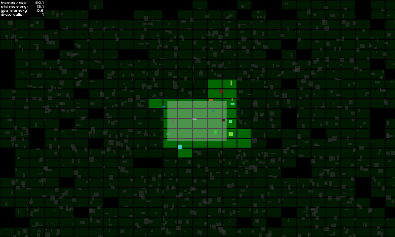

# AS3 / Starling - Spatial Deactivator



This Starling extension is an approach to solve 2D spatial activation / deactivation of game objects. It is meant to take care of showing / hidding game elements that are outside of the screen for example, but not only...
You will be able to basically do what you want with a game object when it is considered as active or inactive.

This library could be useful for you if:	
- Your game objects could leave a defined active area (camera view for instance) and therefore needs to be deactivated.
- Your game objects could interact with each other and you need to make sure that colliding game objects are "safely" deactivated.

For further details about the implementation, please have a look to the [demo page](http://adolio.ch/projects/Starling-Spatial-Deactivator).

## ▶️ Live demo

Try it [here](http://adolio.ch/projects/Starling-Spatial-Deactivator)!

## 😃 How to use it?

### In your ```GameManager```:

```
private var _deactivator:SpatialDeactivator;
private var _activeAreaAABB:Rectangle = new Rectangle(0, 0, 120, 80);

public function MyGameManager()
{
	// Create the spatial deactivator
	_deactivator = new SpatialDeactivator(_activeAreaAABB.width * 0.25, _activeAreaAABB.height * 0.25);
	Starling.current.juggler.add(_deactivator);
}

// Called at each frame...
public function update():void
{
	// Update active area when needed
	_activeAreaAABB.x = ...; // Your complex stuff here
	_activeAreaAABB.y = ...; // Your complex stuff here
	_activeAreaAABB.width = ...; // Your complex stuff here
	_activeAreaAABB.height = ...; // Your complex stuff here
	
	// TODO Update only if AABB has changed!
	_deactivator.updateActiveArea(_activeAreaAABB);
}

public function get deactivator():SpatialDeactivator 
{
	return _deactivator;
}
```

### In your ```GameObject```:

```
private var _spatialElement:SpatialElement;

public function MyGameObject(gameManager:MyGameManager)
{
	// Create spatial element
	_spatialElement = new SpatialElement(gameManager.deactivator, false); // Element starts inactive
	_spatialElement.activityChangedCallback = onSpatialElementActivityChanged;
}

// Called at each frame...
public function update():void
{
	// Update game object position & size
	x = ...; // Your complex stuff here
	y = ...; // Your complex stuff here
	width = ...; // Your complex stuff here
	height = ...; // Your complex stuff here
	
	// TODO Update only if AABB has changed!
	_spatialElement.updateAABB(x, y, width, height);
}

private function onSpatialElementActivityChanged(active:Boolean):void
{
	// Activate / deactivate your object as you want.
	_mySprite.visible = active;
	_myPhysicalBody.enable = active;
	...
}
```

### 🐜 Enabling debug mode

Debug mode will help you to see if you have chosen the right configuration (see important aspects below).

You can enable it simply like this:

```
_deactivator = new SpatialDeactivator(32, 32, true);

if(_deactivator.debugSprite)
	addChild(_deactivator.debugSprite);
```

## ⌨️ How to install?

Just clone or download the repository and copy/paste the ```src/ch``` folder into your ```src``` directory or add the ```src/``` to your class path.


## 💡 Important aspects

### - Find your right chunks size

One important point to make this tool efficient for you is to find the correct chunk size to best fit to your needs.

- Too big chunks will cover too much game objects and therefore activate too much of them at the same time.
- Too small chunks will requires a lot of chunks processing for nothing.

You can test & see what's the best for you by enabling the debug mode (see bellow).

I personnally use a ratio of ```0.25``` compared to the active area size.

```
new SpatialDeactivator(_activeAreaAABB.width * 0.25, _activeAreaAABB.height * 0.25);
```

### - Find your right active area size

If your active area corresponds to the camera view, using margin could be useful to anticipate activation of upcoming game objects.

```
private var _margin:Number = 20;
private var _activeAreaAABB:Rectangle = new Rectangle(0, 0, 120 + _margin, 80 + _margin);
...
_activeAreaAABB.x = x - _margin * 0.5;
_activeAreaAABB.y = y - _margin * 0.5;
deactivator.updateActiveArea(_activeAreaAABB);
```

### - Find your right spatial element size

The size of you element could be for instance a bit bigger than your game object bounds.

```
_spatialElement.updateAABB(x - margin * 0.5, y - margin * 0.5, width + margin, height + margin);
```